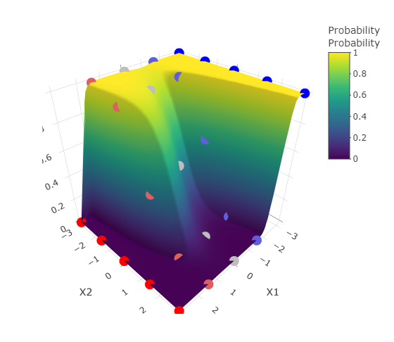

<!-- README.md is generated from README.Rmd. Please edit that file -->

```{r, include = FALSE}
knitr::opts_chunk$set(
  collapse = TRUE,
  comment = "#>",
  fig.path = "man/figures/README-",
  out.width = "100%",
  dev.args = list(png = list(type = "cairo"))
)
```

# idcurveviz

<!-- badges: start -->
<!-- badges: end -->

Identification/2-alternative forced choice tasks are ubiquitous in linguistics
and psychology. However, it is often not immediately clear how the identification
function is affected by different effect sizes or intercept values. This issue
is compounded when higher-order polynomial terms are added to the identification
curve. The goal of `idcurveviz` is to provide a set of easy-to-use functions
that allow users to quickly get an idea of how changing different terms
affects the identification curve.

## Installation

You can install the development version of idcurveviz like so:

``` r
devtools::install_github('tsostarics/idcurveviz')
```

## Usage

The following functions increase in complexity and flexibility.

 - `plot_id_curve`: Plot a *single* polynomial function with one or more 
 intercepts.
 - `plot_interpolated_curves`: Given *two* polynomial functions, interpolate between
 the two with a given number of steps.
 - `animate_interpolated_curves`: Given *multiple* polynomial functions, animate
 interpolations between them.

Other functions for more specific uses:

 - `plot_quantized_curve`: Plot a single polynomial function quantized to a
 given number of steps or specific step values.
 - `plot_id_derivative`: Plot a single polynomial function with its first 
 derivative (via numerical approximation) to show rate of change.
 - `plot_bivariate_surface`: Plot a bivariate identification function as a
 three-dimensional surface via `plotly`.
 

## Examples

What does a single identification curve look like?

```{r single-curve}
library(idcurveviz)
plot_id_curve(betas = c(2, .2, -.5), intercepts = 0)
# plot_id_curve(betas = c(0, 2, .2, -.5), .use_b0 = TRUE) yields the same result
```

How does a given curve change with different intercept values?

```{r default-intercepts}
# If intercepts is not specified, a set range of values is used
plot_id_curve(betas = c(2, .2, -.5))
```

How does a given curve change along a continuum of intercepts?

```{r continuum-intercepts}
plot_id_curve(betas = c(2, .2, -.5),
              intercepts = seq(-3, 3, by=.2))
```

How does a curve change as a cubic effect is added?

```{r multiple-curves}
# Here the intercept is the first term
plot_interpolated_curves(from = c(0, 2, 0, -5),
                         to = c(0, 2, 0, 5),
                         nsteps = 10)
```

How does the identification curve change as we consider each polynomial term?

```{r animated-curves, dev.args=NULL}
animate_interpolated_curves(list(c(0, 0, 0, 0),
                                 c(0, 2, 0, 0),     # Add in linear term
                                 c(0, 2, -1, 0),    # Add in quadratic term
                                 c(0, 2, -1, .1),   # Add in cubic term
                                 c(.5, 2, -1, .1)), # Add in intercept
                            nsteps = 10)
```


How good of an approximation can we get with an evenly-spaced 5 step continuum?
What if we had more steps to our continuum?

```{r quantized-curves}
plot_quantized_curve(betas = c(-.2, 2, .2, -.1),
                     nsteps = 5) +
  add_quantized_curve(betas = c(-.2, 2, .2, -.1),
                      nsteps = 7,
                      quant_color = 'purple')
```

What is the rate of change for an identification curve with a given polynomial?
Where is the point at which the rate of change is highest or lowest?


```{r}
plot_id_derivative(betas = c(-.2, 2.5, -.2, -.5),
                   domain = c(-4, 4))
```

What is the identification function for a bivariate case?


```{r, eval=FALSE}
library(plotly)
plot_bivariate_surface(betas1 = c(0, 2, 0, -1),
                       betas2 = c(0, -2, -.1, 0),
                       show_quantized_points = TRUE)
```

```{r, echo=FALSE}

```

