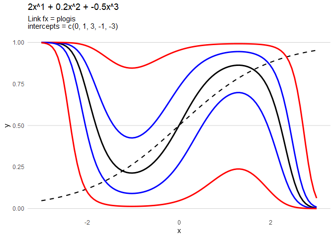
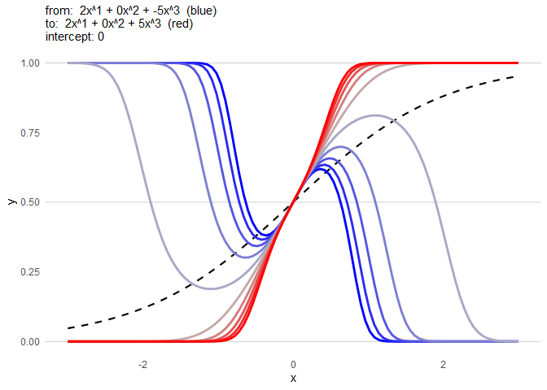

<!-- README.md is generated from README.Rmd. Please edit that file -->

# idcurveviz

<!-- badges: start -->
<!-- badges: end -->

Identification/2-alternative forced choice tasks are ubiquitous in
linguistics and psychology. However, it is often not immediately clear
how the identification function is affected by different effect sizes or
intercept values. This issue is compounded when higher-order polynomial
terms are added to the identification curve. The goal of `idcurveviz` is
to provide a set of easy-to-use functions that allow users to quickly
get an idea of how changing different terms affects the identification
curve.

## Installation

You can install the development version of idcurveviz like so:

``` r
devtools::install_github('tsostarics/idcurveviz')
```

## Examples

How does a given curve change with different intercept values?

``` r
library(idcurveviz)
plot_id_curve(betas = c(2, .2, -.5))
```



How does a given curve change along a continuum of intercepts?

``` r
plot_id_curve(betas = c(2, .2, -.5),
              intercepts = seq(-3, 3, by=.2))
```


How does a curve change as a cubic effect is added?

``` r
plot_interpolated_curves(from = c(2, 0, -5),
                         to = c(2, 0, 5),
                         nsteps = 10)
```



What are the values of those interpolated curves?

``` r
table_interpolations(from = c(2, 0, -5),
                     to = c(2, 0, 5),
                     nsteps = 10)
```

<div id="rjokolzraj" style="overflow-x:auto;overflow-y:auto;width:auto;height:auto;">
<style>html {
  font-family: -apple-system, BlinkMacSystemFont, 'Segoe UI', Roboto, Oxygen, Ubuntu, Cantarell, 'Helvetica Neue', 'Fira Sans', 'Droid Sans', Arial, sans-serif;
}

#rjokolzraj .gt_table {
  display: table;
  border-collapse: collapse;
  margin-left: auto;
  margin-right: auto;
  color: #333333;
  font-size: 16px;
  font-weight: normal;
  font-style: normal;
  background-color: #FFFFFF;
  width: auto;
  border-top-style: solid;
  border-top-width: 2px;
  border-top-color: #A8A8A8;
  border-right-style: none;
  border-right-width: 2px;
  border-right-color: #D3D3D3;
  border-bottom-style: solid;
  border-bottom-width: 2px;
  border-bottom-color: #A8A8A8;
  border-left-style: none;
  border-left-width: 2px;
  border-left-color: #D3D3D3;
}

#rjokolzraj .gt_heading {
  background-color: #FFFFFF;
  text-align: center;
  border-bottom-color: #FFFFFF;
  border-left-style: none;
  border-left-width: 1px;
  border-left-color: #D3D3D3;
  border-right-style: none;
  border-right-width: 1px;
  border-right-color: #D3D3D3;
}

#rjokolzraj .gt_title {
  color: #333333;
  font-size: 125%;
  font-weight: initial;
  padding-top: 4px;
  padding-bottom: 4px;
  padding-left: 5px;
  padding-right: 5px;
  border-bottom-color: #FFFFFF;
  border-bottom-width: 0;
}

#rjokolzraj .gt_subtitle {
  color: #333333;
  font-size: 85%;
  font-weight: initial;
  padding-top: 0;
  padding-bottom: 6px;
  padding-left: 5px;
  padding-right: 5px;
  border-top-color: #FFFFFF;
  border-top-width: 0;
}

#rjokolzraj .gt_bottom_border {
  border-bottom-style: solid;
  border-bottom-width: 2px;
  border-bottom-color: #D3D3D3;
}

#rjokolzraj .gt_col_headings {
  border-top-style: solid;
  border-top-width: 2px;
  border-top-color: #D3D3D3;
  border-bottom-style: solid;
  border-bottom-width: 2px;
  border-bottom-color: #D3D3D3;
  border-left-style: none;
  border-left-width: 1px;
  border-left-color: #D3D3D3;
  border-right-style: none;
  border-right-width: 1px;
  border-right-color: #D3D3D3;
}

#rjokolzraj .gt_col_heading {
  color: #333333;
  background-color: #FFFFFF;
  font-size: 100%;
  font-weight: normal;
  text-transform: inherit;
  border-left-style: none;
  border-left-width: 1px;
  border-left-color: #D3D3D3;
  border-right-style: none;
  border-right-width: 1px;
  border-right-color: #D3D3D3;
  vertical-align: bottom;
  padding-top: 5px;
  padding-bottom: 6px;
  padding-left: 5px;
  padding-right: 5px;
  overflow-x: hidden;
}

#rjokolzraj .gt_column_spanner_outer {
  color: #333333;
  background-color: #FFFFFF;
  font-size: 100%;
  font-weight: normal;
  text-transform: inherit;
  padding-top: 0;
  padding-bottom: 0;
  padding-left: 4px;
  padding-right: 4px;
}

#rjokolzraj .gt_column_spanner_outer:first-child {
  padding-left: 0;
}

#rjokolzraj .gt_column_spanner_outer:last-child {
  padding-right: 0;
}

#rjokolzraj .gt_column_spanner {
  border-bottom-style: solid;
  border-bottom-width: 2px;
  border-bottom-color: #D3D3D3;
  vertical-align: bottom;
  padding-top: 5px;
  padding-bottom: 5px;
  overflow-x: hidden;
  display: inline-block;
  width: 100%;
}

#rjokolzraj .gt_group_heading {
  padding-top: 8px;
  padding-bottom: 8px;
  padding-left: 5px;
  padding-right: 5px;
  color: #333333;
  background-color: #FFFFFF;
  font-size: 100%;
  font-weight: initial;
  text-transform: inherit;
  border-top-style: solid;
  border-top-width: 2px;
  border-top-color: #D3D3D3;
  border-bottom-style: solid;
  border-bottom-width: 2px;
  border-bottom-color: #D3D3D3;
  border-left-style: none;
  border-left-width: 1px;
  border-left-color: #D3D3D3;
  border-right-style: none;
  border-right-width: 1px;
  border-right-color: #D3D3D3;
  vertical-align: middle;
}

#rjokolzraj .gt_empty_group_heading {
  padding: 0.5px;
  color: #333333;
  background-color: #FFFFFF;
  font-size: 100%;
  font-weight: initial;
  border-top-style: solid;
  border-top-width: 2px;
  border-top-color: #D3D3D3;
  border-bottom-style: solid;
  border-bottom-width: 2px;
  border-bottom-color: #D3D3D3;
  vertical-align: middle;
}

#rjokolzraj .gt_from_md > :first-child {
  margin-top: 0;
}

#rjokolzraj .gt_from_md > :last-child {
  margin-bottom: 0;
}

#rjokolzraj .gt_row {
  padding-top: 8px;
  padding-bottom: 8px;
  padding-left: 5px;
  padding-right: 5px;
  margin: 10px;
  border-top-style: solid;
  border-top-width: 1px;
  border-top-color: #D3D3D3;
  border-left-style: none;
  border-left-width: 1px;
  border-left-color: #D3D3D3;
  border-right-style: none;
  border-right-width: 1px;
  border-right-color: #D3D3D3;
  vertical-align: middle;
  overflow-x: hidden;
}

#rjokolzraj .gt_stub {
  color: #333333;
  background-color: #FFFFFF;
  font-size: 100%;
  font-weight: initial;
  text-transform: inherit;
  border-right-style: solid;
  border-right-width: 2px;
  border-right-color: #D3D3D3;
  padding-left: 5px;
  padding-right: 5px;
}

#rjokolzraj .gt_stub_row_group {
  color: #333333;
  background-color: #FFFFFF;
  font-size: 100%;
  font-weight: initial;
  text-transform: inherit;
  border-right-style: solid;
  border-right-width: 2px;
  border-right-color: #D3D3D3;
  padding-left: 5px;
  padding-right: 5px;
  vertical-align: top;
}

#rjokolzraj .gt_row_group_first td {
  border-top-width: 2px;
}

#rjokolzraj .gt_summary_row {
  color: #333333;
  background-color: #FFFFFF;
  text-transform: inherit;
  padding-top: 8px;
  padding-bottom: 8px;
  padding-left: 5px;
  padding-right: 5px;
}

#rjokolzraj .gt_first_summary_row {
  border-top-style: solid;
  border-top-color: #D3D3D3;
}

#rjokolzraj .gt_first_summary_row.thick {
  border-top-width: 2px;
}

#rjokolzraj .gt_last_summary_row {
  padding-top: 8px;
  padding-bottom: 8px;
  padding-left: 5px;
  padding-right: 5px;
  border-bottom-style: solid;
  border-bottom-width: 2px;
  border-bottom-color: #D3D3D3;
}

#rjokolzraj .gt_grand_summary_row {
  color: #333333;
  background-color: #FFFFFF;
  text-transform: inherit;
  padding-top: 8px;
  padding-bottom: 8px;
  padding-left: 5px;
  padding-right: 5px;
}

#rjokolzraj .gt_first_grand_summary_row {
  padding-top: 8px;
  padding-bottom: 8px;
  padding-left: 5px;
  padding-right: 5px;
  border-top-style: double;
  border-top-width: 6px;
  border-top-color: #D3D3D3;
}

#rjokolzraj .gt_striped {
  background-color: rgba(128, 128, 128, 0.05);
}

#rjokolzraj .gt_table_body {
  border-top-style: solid;
  border-top-width: 2px;
  border-top-color: #D3D3D3;
  border-bottom-style: solid;
  border-bottom-width: 2px;
  border-bottom-color: #D3D3D3;
}

#rjokolzraj .gt_footnotes {
  color: #333333;
  background-color: #FFFFFF;
  border-bottom-style: none;
  border-bottom-width: 2px;
  border-bottom-color: #D3D3D3;
  border-left-style: none;
  border-left-width: 2px;
  border-left-color: #D3D3D3;
  border-right-style: none;
  border-right-width: 2px;
  border-right-color: #D3D3D3;
}

#rjokolzraj .gt_footnote {
  margin: 0px;
  font-size: 90%;
  padding-left: 4px;
  padding-right: 4px;
  padding-left: 5px;
  padding-right: 5px;
}

#rjokolzraj .gt_sourcenotes {
  color: #333333;
  background-color: #FFFFFF;
  border-bottom-style: none;
  border-bottom-width: 2px;
  border-bottom-color: #D3D3D3;
  border-left-style: none;
  border-left-width: 2px;
  border-left-color: #D3D3D3;
  border-right-style: none;
  border-right-width: 2px;
  border-right-color: #D3D3D3;
}

#rjokolzraj .gt_sourcenote {
  font-size: 90%;
  padding-top: 4px;
  padding-bottom: 4px;
  padding-left: 5px;
  padding-right: 5px;
}

#rjokolzraj .gt_left {
  text-align: left;
}

#rjokolzraj .gt_center {
  text-align: center;
}

#rjokolzraj .gt_right {
  text-align: right;
  font-variant-numeric: tabular-nums;
}

#rjokolzraj .gt_font_normal {
  font-weight: normal;
}

#rjokolzraj .gt_font_bold {
  font-weight: bold;
}

#rjokolzraj .gt_font_italic {
  font-style: italic;
}

#rjokolzraj .gt_super {
  font-size: 65%;
}

#rjokolzraj .gt_two_val_uncert {
  display: inline-block;
  line-height: 1em;
  text-align: right;
  font-size: 60%;
  vertical-align: -0.25em;
  margin-left: 0.1em;
}

#rjokolzraj .gt_footnote_marks {
  font-style: italic;
  font-weight: normal;
  font-size: 75%;
  vertical-align: 0.4em;
}

#rjokolzraj .gt_asterisk {
  font-size: 100%;
  vertical-align: 0;
}

#rjokolzraj .gt_slash_mark {
  font-size: 0.7em;
  line-height: 0.7em;
  vertical-align: 0.15em;
}

#rjokolzraj .gt_fraction_numerator {
  font-size: 0.6em;
  line-height: 0.6em;
  vertical-align: 0.45em;
}

#rjokolzraj .gt_fraction_denominator {
  font-size: 0.6em;
  line-height: 0.6em;
  vertical-align: -0.05em;
}
</style>
<table class="gt_table">
  
  <thead class="gt_col_headings">
    <tr>
      <th class="gt_col_heading gt_columns_bottom_border gt_right" rowspan="1" colspan="1">X1</th>
      <th class="gt_col_heading gt_columns_bottom_border gt_right" rowspan="1" colspan="1">X2</th>
      <th class="gt_col_heading gt_columns_bottom_border gt_right" rowspan="1" colspan="1">X3</th>
      <th class="gt_col_heading gt_columns_bottom_border gt_right" rowspan="1" colspan="1">curve</th>
    </tr>
  </thead>
  <tbody class="gt_table_body">
    <tr><td class="gt_row gt_right">2</td>
<td class="gt_row gt_right">0</td>
<td class="gt_row gt_right">-5.00</td>
<td class="gt_row gt_right"><div>
  <div style="height: 20px;width:70px; background-color: #0000FF33;border-radius:5px;)">
    <div style="height: 15px;width: 15px;background-color: #0000FF;display: inline-block;border-radius:5px;float:left;position:relative;top:13%;left:5%;"></div>
    <div style="display: inline-block;float:right;line-height:20px;padding: 0px 2.5px;">1</div>
  </div>
</div></td></tr>
    <tr><td class="gt_row gt_right">2</td>
<td class="gt_row gt_right">0</td>
<td class="gt_row gt_right">-3.89</td>
<td class="gt_row gt_right"><div>
  <div style="height: 20px;width:70px; background-color: #663EF233;border-radius:5px;)">
    <div style="height: 15px;width: 15px;background-color: #663EF2;display: inline-block;border-radius:5px;float:left;position:relative;top:13%;left:5%;"></div>
    <div style="display: inline-block;float:right;line-height:20px;padding: 0px 2.5px;">2</div>
  </div>
</div></td></tr>
    <tr><td class="gt_row gt_right">2</td>
<td class="gt_row gt_right">0</td>
<td class="gt_row gt_right">-2.78</td>
<td class="gt_row gt_right"><div>
  <div style="height: 20px;width:70px; background-color: #8B64E433;border-radius:5px;)">
    <div style="height: 15px;width: 15px;background-color: #8B64E4;display: inline-block;border-radius:5px;float:left;position:relative;top:13%;left:5%;"></div>
    <div style="display: inline-block;float:right;line-height:20px;padding: 0px 2.5px;">3</div>
  </div>
</div></td></tr>
    <tr><td class="gt_row gt_right">2</td>
<td class="gt_row gt_right">0</td>
<td class="gt_row gt_right">-1.67</td>
<td class="gt_row gt_right"><div>
  <div style="height: 20px;width:70px; background-color: #A488D633;border-radius:5px;)">
    <div style="height: 15px;width: 15px;background-color: #A488D6;display: inline-block;border-radius:5px;float:left;position:relative;top:13%;left:5%;"></div>
    <div style="display: inline-block;float:right;line-height:20px;padding: 0px 2.5px;">4</div>
  </div>
</div></td></tr>
    <tr><td class="gt_row gt_right">2</td>
<td class="gt_row gt_right">0</td>
<td class="gt_row gt_right">-0.56</td>
<td class="gt_row gt_right"><div>
  <div style="height: 20px;width:70px; background-color: #B7ACC633;border-radius:5px;)">
    <div style="height: 15px;width: 15px;background-color: #B7ACC6;display: inline-block;border-radius:5px;float:left;position:relative;top:13%;left:5%;"></div>
    <div style="display: inline-block;float:right;line-height:20px;padding: 0px 2.5px;">5</div>
  </div>
</div></td></tr>
    <tr><td class="gt_row gt_right">2</td>
<td class="gt_row gt_right">0</td>
<td class="gt_row gt_right">0.56</td>
<td class="gt_row gt_right"><div>
  <div style="height: 20px;width:70px; background-color: #CDB1AA33;border-radius:5px;)">
    <div style="height: 15px;width: 15px;background-color: #CDB1AA;display: inline-block;border-radius:5px;float:left;position:relative;top:13%;left:5%;"></div>
    <div style="display: inline-block;float:right;line-height:20px;padding: 0px 2.5px;">6</div>
  </div>
</div></td></tr>
    <tr><td class="gt_row gt_right">2</td>
<td class="gt_row gt_right">0</td>
<td class="gt_row gt_right">1.67</td>
<td class="gt_row gt_right"><div>
  <div style="height: 20px;width:70px; background-color: #E2958233;border-radius:5px;)">
    <div style="height: 15px;width: 15px;background-color: #E29582;display: inline-block;border-radius:5px;float:left;position:relative;top:13%;left:5%;"></div>
    <div style="display: inline-block;float:right;line-height:20px;padding: 0px 2.5px;">7</div>
  </div>
</div></td></tr>
    <tr><td class="gt_row gt_right">2</td>
<td class="gt_row gt_right">0</td>
<td class="gt_row gt_right">2.78</td>
<td class="gt_row gt_right"><div>
  <div style="height: 20px;width:70px; background-color: #F0775A33;border-radius:5px;)">
    <div style="height: 15px;width: 15px;background-color: #F0775A;display: inline-block;border-radius:5px;float:left;position:relative;top:13%;left:5%;"></div>
    <div style="display: inline-block;float:right;line-height:20px;padding: 0px 2.5px;">8</div>
  </div>
</div></td></tr>
    <tr><td class="gt_row gt_right">2</td>
<td class="gt_row gt_right">0</td>
<td class="gt_row gt_right">3.89</td>
<td class="gt_row gt_right"><div>
  <div style="height: 20px;width:70px; background-color: #FA523333;border-radius:5px;)">
    <div style="height: 15px;width: 15px;background-color: #FA5233;display: inline-block;border-radius:5px;float:left;position:relative;top:13%;left:5%;"></div>
    <div style="display: inline-block;float:right;line-height:20px;padding: 0px 2.5px;">9</div>
  </div>
</div></td></tr>
    <tr><td class="gt_row gt_right">2</td>
<td class="gt_row gt_right">0</td>
<td class="gt_row gt_right">5.00</td>
<td class="gt_row gt_right"><div>
  <div style="height: 20px;width:70px; background-color: #FF000033;border-radius:5px;)">
    <div style="height: 15px;width: 15px;background-color: #FF0000;display: inline-block;border-radius:5px;float:left;position:relative;top:13%;left:5%;"></div>
    <div style="display: inline-block;float:right;line-height:20px;padding: 0px 2.5px;">10</div>
  </div>
</div></td></tr>
  </tbody>
  
  
</table>
</div>

How good of an approximation can we get with an evenly-spaced 5 step
continuum? What if we had more steps to our continuum?

``` r
plot_quantized_curve(betas = c(2, .2, -.1),
                     nsteps = 5) +
  add_quantized_curve(betas = c(2, .2, -.1),
                      nsteps = 7,
                      quant_color = 'purple')
```


